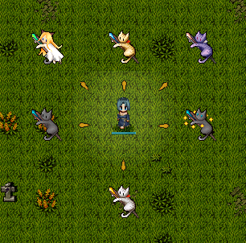

# ffhp

Implements FFHP's customization features that need dynamic chip replacement.

Basic theming needs can be satisfied by overriding the properties of data types like `base.chip`. However, there are cases like random items where the themed asset needs to be substituted in-game, since the type of those items is only known to the player when the item is fully identified. This mod implements features like those by replacing the chip after events like item identification, and should (hopefully) make it easy to implement this behavior for new objects that can have multiple themable assets.

This mod also implements omake's extension to FFHP that allows for directional item chip variants. When an item is dropped, you will now be able to choose a chip variant if the FFHP override for that item has any chip overrides available.

## Notes

By default, FFHP item overrides will only take effect if the item has been identified in the past at least once. This is different than normal FFHP, where the image would always be substituted regardless of identify state.
